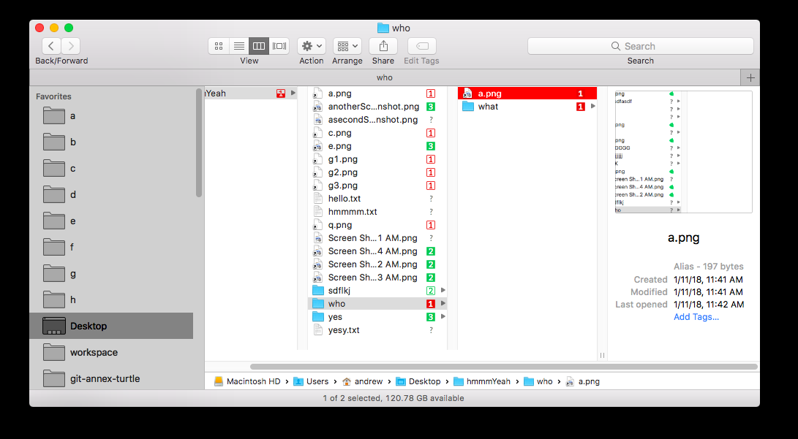
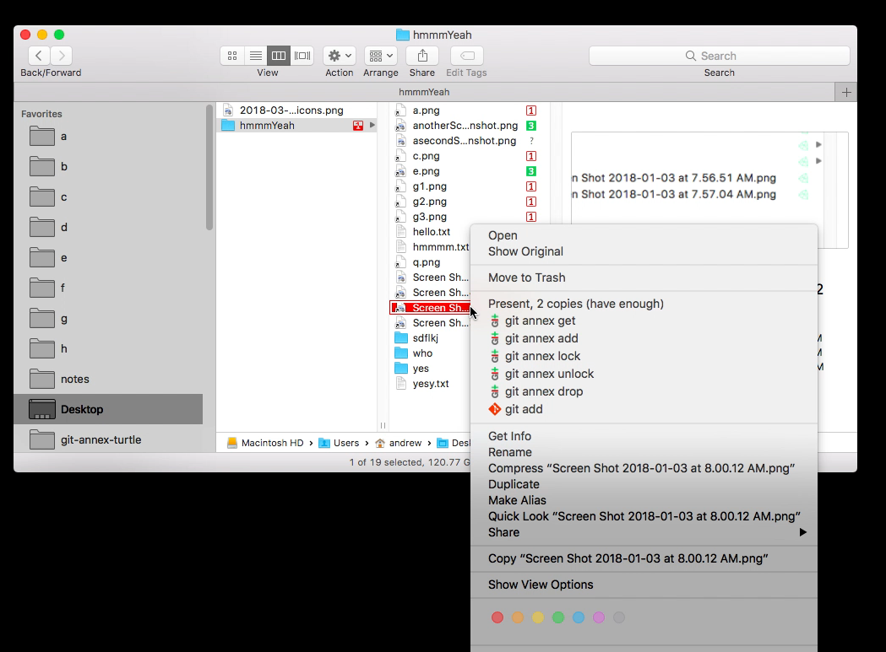

# git-annex-turtle
*git-annex-turtle* provides <a href="https://en.wikipedia.org/wiki/Finder_(software)">Apple Finder</a> integration for [git-annex](http://git-annex.branchable.com/) on macOS, including custom badge icons (badges), contextual menus (control-clicks) and a Menubar icon (aka menubar extra). *git-annex-turtle* is a native Mac app written in Swift 4 with XCode 9.2 and requires macOS 10.12 or later. 

*git-annex-turtle* is free, open-source and licensed under [The MIT License](https://opensource.org/licenses/MIT). *git-annex-turtle* includes software and creative works/assets that are licensed under other open source licenses, see [OTHER_LICENSES.txt](OTHER_LICENSES.txt) for more information.

## Features
 * **badges:** *git-annex-turtle* adds a badge icon (badges) for every file and folder in monitored git-annex repositories indicating present/absent status, number of copies and whether or not copies are lacking.
 * **contextual menus:** *git-annex-turtle* adds contextual menus (control-clicks) to all files and folders (in monitored repos) allowing quick access to git-annex get/drop/add and more.
 * **menubar icon:** *git-annex-turtle* adds a Menubar icon (aka menubar extra) showing animated activity status, monitored folder status and a preferences menu.

### Badges
For **files** badges signify if they are present or absent, their number of copies and whether or not they have the desired number of [git-annex copies](https://git-annex.branchable.com/git-annex-numcopies/) (`numcopies`). Present or absent status is signified by a filled (solid) in vs not-filled (empty) square. Number of copies is signified by digits ranging from 0 to 4 or a star for files with 5 or more copies. If a file has at least the amount of copies specified in your `numcopies` setting (or in a `.gitattributes` override) the icon is colored green, otherwise red.

For **folders** badges signify status of the files contained within. They signify if all the files are present, some are present or all are absent. If all files are present icon is a solid square, if all files are absent icon is an empty square, otherwise if some files are present icon is a partially filed square. The icon's digit signifies the number of copies of the file with the least copies contained within. If every file contained within the folder has at least the desired number of copies the icon is colored green, otherwise red.

**Examples:**

| Icon | Description |
| ---- | ----------- |
|  | A present file with 2 copies and having the desired number of copies; or a folder containing only present files with 2 or more copies and all files having the desired number of copies. |
|  | A present file with 5 or more copies; or a folder containing only present files each with 5 or more copies. All files have the desired number of copies. |
|  | A file that with 3 copies that is not present; or a folder containing only absent files each having 3 or more copies. |
|  | A file with 5 or more copies that is not present and has the desired number of copies; or a folder containing only absent files each with 5 or more copies all of which have the desired number of copies. |
|  | A folder containing at least 2 copies of all files, some are present, some are absent. All files have the desired number of copies. |
|  | A folder containing both present and absent files each with 5 or more copies and all having at least the desired number of copies. |
|  | A present file with 4 copies and having less than the desired number of copies; or a folder containing only present files each with 4 or more copies and where one or more files have less than the desired number of copies.  |
|  | A present file with 5 or more copies and having less than the desired number of copies; or a folder containing only present files each with 5 or more copies and where one or more files have less than the desired number of copies. |
|  | A file with 4 copies that is not present and has less than the desired number of copies; or a folder containing only absent files each with 4 or more copies and one or more of which having less than the desired number of copies |
|  | A file with 5 or more copies that is not present and has less than the desired number of copies; or a folder containing only absent files each with 5 or more copies and one or more of which having less than the desired number of copies. |
|  | A folder containing both present and absent files each with 2 or more copies and one or more of which having less than the desired number of copies. |
|  | A folder containing both present and absent files each with 5 or more copies and one or more of which having less than the desired number of copies. |
|  | A file with no known copies (implies not present); or a folder containing all absent files, one of which has no known copies. |
|  | An empty folder or a folder containing only non-annexed files or more empty folders. |
|  | A file that was scanned successfully but has a state that is not yet handled by *git-annex-turtle* |

## Getting Started
### Install
Download and install [git-annex](http://git-annex.branchable.com/install/OSX/) for macOS. Follow the git-annex [walkthrough](http://git-annex.branchable.com/walkthrough/) if you have never used git-annex before.

Download and install git-annex-turtle.

**Requires:** macOS 10.12 or later

### Usage
Click the git-annex-turtle Menubar icon, then click `Preferences…`, then click `+` to add a new git-annex repository to watch.

*git-annex-turtle* will then perform an initial `full scan` of the repository you added. *The full scan is required so that we may cache status information for folders, since only file-level status is stored by git and git-annex.*

View your git-annex repository in Apple Finder to see updated badge icons. Right click (control-click) on a file or folder to see git-annex specific context menus. Badge icons will appear progressively as the full scan completes.

### Requirements
macOS 10.12 or later

*git-annex-turtle* relies on the Apple Finder Sync API, which is only available on OS-X 10.10 (Yosemite) and later and all versions of macOS. The [Liferay Nativity](https://github.com/liferay/liferay-nativity) library could potentially be used to enable *git-annex-turtle* to run on older Mac OSs. I am also using features of CoreData which are only available on macOS 10.12 and later.

*git-annex-turtle* is released for the the Mac only; it is written in Swift with XCode so is probably not easily portable to Linux and Windows. You may, of course, adapt and use this app's user experience, design, workflow and icon sets when porting to other OSs. See git-annex [related software](http://git-annex.branchable.com/related_software/) for options already built for other OSs.

### Issues
The Apple Finder Sync Extension only allows one extension to register itself per folder, so other apps might be conflicting with *git-annex-turtle*. For example, Dropbox, registers its Finder Sync extension on your entire home folder (Users/yourname), regardless of where your actual Dropbox folder is located. Dropbox does this, apparently, so they can have “move to Dropbox” context menus on every single file. Launch `System Preferences > Extensions > Finder` to see what apps have Finder Sync extensions registered. If you want to continue using Dropbox, partially, you can disable `Finder Integration` in their Preferences menu, cloud syncing then should still continue to operate.

### Important Directories
`~/Library/Group Containers/group.com.andrewringler.git-annex-mac.sharedgroup`
App Group location for sqlite database. You may safely delete this folder if the app and all extension processes are not running. All full scans will then restart on the next launch of *git-annex-turtle*.

 `~/.config/git-annex/turtle-monitor`
Stores config settings for *git-annex-turtle*, that are editable through the menubar icon or by editing the file directly. Uses [git config](https://git-scm.com/docs/git-config/) style syntax. You may safely update this file manually and the app will detect your changes, but note that adding and removing repos via the GUI will clobber any comments or unknown lines you have added manually to this file. 

## Name
*git-annex-turtle* takes inspiration in function and name from [TortoiseCVS](https://en.wikipedia.org/wiki/TortoiseCVS) and the many other tools which have provided OS-level filesystem icons for source revision control software.

## Build a Release
 * Open git-annex-turtle.xcodeproj in XCode 9.2
 * Click on the git-annex-turtle scheme (to the right of the triangle play button top of screen), click Edit Scheme, Make sure Run > Build Configuration is set to Release
 * Select the Scheme 'git-annex-turtle' then build: Product > Build 
 * You will find the .app in Open the ~/Library/Developer/Xcode/DerivedData/ directory and Look for git-annex-turtle-…/Build/Products/Release/git-annex-turtle.app
